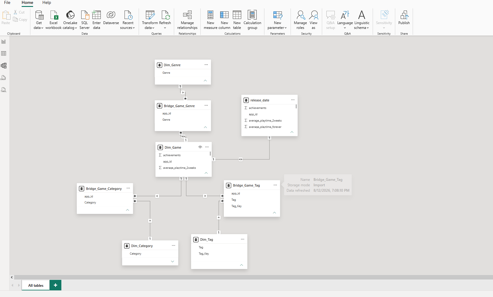

# 🎮 Steam Game Analytics

An end-to-end data analytics project built with **Power BI** to explore Steam games from multiple perspectives, including game popularity, player engagement, pricing, genres, and tags.

The project takes a raw Steam games dataset through a complete analytics workflow — from **data cleaning and transformation**, to **data modeling and DAX measures**, and finally to an interactive three-page Power BI dashboard.

---

## 📌 Project Overview

The goal of this project was not only to visualize the Steam games dataset, but to turn the raw data into a structured analytical report that answers different types of questions about the games.

The dashboard was intentionally divided into three pages, with each page having a different analytical purpose:

### 1. Steam Overview

**"What does the Steam games dataset look like overall?"**

This page provides the high-level picture of the dataset, including:

* Number of games
* Positive review rate
* Positive reviews
* Average Metacritic score
* Average game price
* Games released over time
* Game distribution by genre
* Top games by Peak CCU

The purpose of this page is to give the user a quick understanding of the dataset before moving into deeper analysis.


---

### 2. Game Analysis

**"How do individual games perform and how engaged are their players?"**

The second page focuses on game-level performance and player engagement.

It explores:

* Average playtime
* Average Peak CCU
* Total recommendations
* Estimated maximum owners
* Free vs paid games
* Price vs playtime
* Playtime vs Peak CCU
* Top games by recommendations

This page also allows the analysis to be explored through filters such as:

* Year
* Genre
* Price status

The objective is to move from the overall Steam picture into understanding **what separates games in terms of popularity and player engagement**.


---

### 3. Genres / Tags Analysis

**"How do genres and tags shape the Steam games landscape?"**

The final page shifts the analysis from individual games to groups of games.

It explores:

* Total genres
* Top genre
* Average games per genre
* Total tags
* Average Peak CCU by genre
* Genre distribution
* Genre by price status
* Most common tags by game count

This page helps identify patterns across genres and tags and provides a broader view of how different categories of games are represented and engaged with on Steam.


---

# 🔄 Data Analytics Workflow

The project followed a complete analytics workflow:

```text
Raw Steam Dataset
       ↓
Data Cleaning & Transformation
       ↓
Data Modeling
       ↓
DAX Measures
       ↓
Dashboard Design
       ↓
Interactive Analysis
```

## 1. Data Cleaning & Transformation

The raw dataset contained game-level information such as:

* Game name
* App ID
* Price
* Reviews
* Recommendations
* Playtime
* Peak CCU
* Estimated owners
* Release date
* Genres
* Tags
* Metacritic score

The data was cleaned and transformed before being used in the analytical model.

Key preparation work included:

* Cleaning inconsistent values
* Handling missing and unavailable values
* Preparing date fields
* Separating multi-value genre information
* Preparing genre relationships
* Creating structures suitable for Power BI analysis


> The cleaned data screenshot is included to demonstrate the transformation stage of the project.

---

# 🧩 Data Model

After preparing the data, a dimensional model was created to make the dataset easier to analyze and to avoid relying on a single flat table.

The model includes structures such as:

* `DIM_GAME`
* `STEAM_GAME`
* `BRIDGE_GAME_GENRS`
* Dedicated Measures table

The bridge table was used to handle the relationship between games and genres, allowing genre-level analysis without duplicating the game data unnecessarily.



---

# 🧮 DAX & Measures

DAX measures were created to provide reusable calculations throughout the dashboard.

Examples include:

* Total Games
* Positive Review Rate
* Positive Reviews
* Average Metacritic Score
* Average Price
* Average Playtime Hours
* Average Peak CCU
* Total Recommendations
* Total Owners Max
* Total Genres
* Top Genre
* Average Games per Genre
* Total Tags

For example, the total number of games is calculated using:

```DAX
Total Games =
DISTINCTCOUNT(Dim_Game[app_id])
```

Using measures instead of manually calculated values allows the dashboard to respond dynamically to filters and user selections.

---

# 📊 Key Dataset Statistics

The final dataset used in the dashboard contains:

| Metric                   | Value |
| ------------------------ | ----: |
| Total Games              |   292 |
| Paid Games               |   278 |
| Free Games               |    13 |
| Unavailable Price Status |     1 |
| Total Genres             |    11 |
| Total Tags               |   353 |

---

# 🔍 Key Analytical Questions

The dashboard was designed around practical analytical questions rather than simply displaying individual metrics.

### Overall Steam Landscape

* How many games are included in the dataset?
* How has game release activity changed over time?
* Which genres contain the most games?
* Which games have the highest Peak CCU?

### Game Performance

* How does player engagement differ between games?
* Is there a relationship between price and playtime?
* Is higher playtime associated with higher Peak CCU?
* Which games receive the most recommendations?
* How do free and paid games compare?

### Genre & Tag Analysis

* Which genres dominate the dataset?
* Which genres have the highest average Peak CCU?
* How are free and paid games distributed across genres?
* Which tags appear most frequently?

---

# 💡 Project Focus

The main objective of the project was to demonstrate how raw game data can be transformed into an analytical product that allows users to move through different levels of analysis:

```text
Dataset Overview
      ↓
Game-Level Performance
      ↓
Genre & Tag Patterns
```

Each dashboard page therefore has a distinct role rather than repeating the same KPIs and visualizations.

---

# 🛠️ Tools & Technologies

* **Power BI**
* **Power Query**
* **DAX**
* **Data Modeling**
* **Data Cleaning & Transformation**
* **Data Visualization**
* **GitHub**

---

# 📷 Dashboard Preview

### Steam Overview


### Game Analysis


### Genres / Tags Analysis


### Data Model


---

## 🎯 Final Outcome

The final result is an interactive Power BI report that transforms the Steam games dataset into a structured analytical experience.

The project demonstrates the complete process of taking data from its raw form and turning it into a usable business intelligence solution through:

**Cleaning → Modeling → DAX → Visualization → Analysis**
